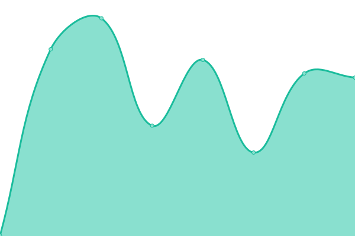
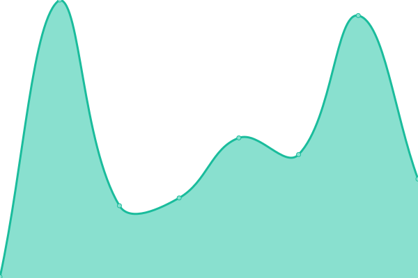
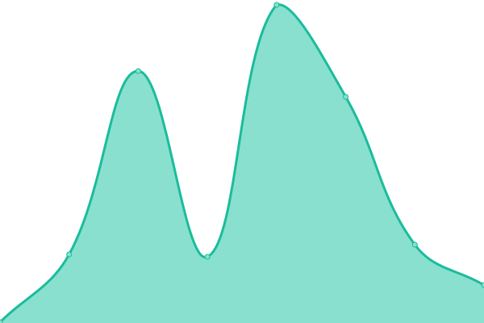

# [📈 Live Status](https://upptime.github.io/upptime): <!--live status--> **🟩 All systems operational**

This repository contains the open-source uptime monitor and status page for [Upptime](https://upptime.js.org), powered by [Upptime](https://github.com/upptime/upptime).

With [Upptime](https://upptime.js.org), you can get your own unlimited and free uptime monitor and status page, powered entirely by a GitHub repository. We use [Issues](https://github.com/upptime/upptime/issues) as incident reports, [Actions](https://github.com/anduintransaction/upptime/actions) as uptime monitors, and [Pages](https://upptime.github.io/upptime) for the status page.

<!--start: status pages-->
<!-- This summary is generated by Upptime (https://github.com/upptime/upptime) -->
<!-- Do not edit this manually, your changes will be overwritten -->
<!-- prettier-ignore -->
| URL | Status | History | Response Time | Uptime |
| --- | ------ | ------- | ------------- | ------ |
|  [Anduin company landing page](https://www.anduintransact.com) | 🟩 Up | [anduin-company-landing-page.yml](https://github.com/anduintransaction/upptime/commits/HEAD/history/anduin-company-landing-page.yml) | 

 281ms
     
 | 

<a href="https://anduintransaction.github.io/upptime/history/anduin-company-landing-page">100.00%</a>
    

|  [Fundsub landing page](https://www.fundsub.io) | 🟩 Up | [fundsub-landing-page.yml](https://github.com/anduintransaction/upptime/commits/HEAD/history/fundsub-landing-page.yml) | 

 1578ms
     
 | 

<a href="https://anduintransaction.github.io/upptime/history/fundsub-landing-page">99.88%</a>
    

|  [Fundsub contact page](https://www.fundsub.io/contact) | 🟩 Up | [fundsub-contact-page.yml](https://github.com/anduintransaction/upptime/commits/HEAD/history/fundsub-contact-page.yml) | 

 1565ms
     
 | 

<a href="https://anduintransaction.github.io/upptime/history/fundsub-contact-page">99.88%</a>
    

|  [Anduin Dataroom landing page](https://www.metadataroom.io/) | 🟩 Up | [anduin-dataroom-landing-page.yml](https://github.com/anduintransaction/upptime/commits/HEAD/history/anduin-dataroom-landing-page.yml) | 

 3072ms
     
 | 

<a href="https://anduintransaction.github.io/upptime/history/anduin-dataroom-landing-page">99.89%</a>
    

|  [Anduin Dataroom contact page](https://www.metadataroom.io/contact) | 🟩 Up | [anduin-dataroom-contact-page.yml](https://github.com/anduintransaction/upptime/commits/HEAD/history/anduin-dataroom-contact-page.yml) | 

 1386ms
     
 | 

<a href="https://anduintransaction.github.io/upptime/history/anduin-dataroom-contact-page">99.89%</a>
    

|  [AnduinSign landing page](https://www.anduinsign.io/) | 🟩 Up | [anduin-sign-landing-page.yml](https://github.com/anduintransaction/upptime/commits/HEAD/history/anduin-sign-landing-page.yml) | 

 725ms
     
 | 

<a href="https://anduintransaction.github.io/upptime/history/anduin-sign-landing-page">100.00%</a>
    

|  [AnduinSign contact page](https://www.anduinsign.io/contact) | 🟩 Up | [anduin-sign-contact-page.yml](https://github.com/anduintransaction/upptime/commits/HEAD/history/anduin-sign-contact-page.yml) | 

 82ms
     
 | 

<a href="https://anduintransaction.github.io/upptime/history/anduin-sign-contact-page">100.00%</a>
    

|  [Anduin App login page](https://id.anduin.app/#/login) | 🟩 Up | [anduin-app-login-page.yml](https://github.com/anduintransaction/upptime/commits/HEAD/history/anduin-app-login-page.yml) | 

 195ms
     
 | 

<a href="https://anduintransaction.github.io/upptime/history/anduin-app-login-page">100.00%</a>
    

|  [Anduin App Deal status](https://deals.anduintransact.com/api/v2/standalone-app/get-app-version) | 🟩 Up | [anduin-app-deal-status.yml](https://github.com/anduintransaction/upptime/commits/HEAD/history/anduin-app-deal-status.yml) | 

 187ms
     
 | 

<a href="https://anduintransaction.github.io/upptime/history/anduin-app-deal-status">100.00%</a>
    

|  [Anduin App Dataroom status](https://dataroom.anduin.app/api/v2/standalone-app/get-app-version) | 🟩 Up | [anduin-app-dataroom-status.yml](https://github.com/anduintransaction/upptime/commits/HEAD/history/anduin-app-dataroom-status.yml) | 

 203ms
     
 | 

<a href="https://anduintransaction.github.io/upptime/history/anduin-app-dataroom-status">100.00%</a>
    

|  [Anduin App Sign status](https://sign.anduin.app/api/v2/standalone-app/get-app-version) | 🟩 Up | [anduin-app-sign-status.yml](https://github.com/anduintransaction/upptime/commits/HEAD/history/anduin-app-sign-status.yml) | 

 194ms
     
 | 

<a href="https://anduintransaction.github.io/upptime/history/anduin-app-sign-status">100.00%</a>
    

<!--end: status pages-->

[**Visit our status website →**](https://anduintransaction.github.io/upptime/)

## 📄 License

- Powered by: [Upptime](https://github.com/upptime/upptime)
- Code: [MIT](./LICENSE) © [Upptime](https://upptime.js.org)
- Data in the `./history` directory: [Open Database License](https://opendatacommons.org/licenses/odbl/1-0/)
