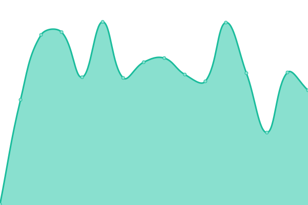

# [📈 Live Status](https://upptime.github.io/upptime): <!--live status--> **🟩 All systems operational**

This repository contains the open-source uptime monitor and status page for [Upptime](https://upptime.js.org), powered by [Upptime](https://github.com/upptime/upptime).

With [Upptime](https://upptime.js.org), you can get your own unlimited and free uptime monitor and status page, powered entirely by a GitHub repository. We use [Issues](https://github.com/upptime/upptime/issues) as incident reports, [Actions](https://github.com/anduintransaction/upptime/actions) as uptime monitors, and [Pages](https://upptime.github.io/upptime) for the status page.

<!--start: status pages-->
<!-- This summary is generated by Upptime (https://github.com/upptime/upptime) -->
<!-- Do not edit this manually, your changes will be overwritten -->
<!-- prettier-ignore -->
| URL | Status | History | Response Time | Uptime |
| --- | ------ | ------- | ------------- | ------ |
|  [Website](https://anduintransact.com) | 🟩 Up | [website.yml](https://github.com/anduintransaction/upptime/commits/HEAD/history/website.yml) | 

 333ms
     
 | 

<a href="https://status.anduin.report/history/website">100.00%</a>
    

|  [Support page](https://support.anduintransact.com/) | 🟩 Up | [support-page.yml](https://github.com/anduintransaction/upptime/commits/HEAD/history/support-page.yml) | 

 315ms
     
 | 

<a href="https://status.anduin.report/history/support-page">100.00%</a>
    

|  [Contact page](https://anduintransact.com/contact) | 🟩 Up | [contact-page.yml](https://github.com/anduintransaction/upptime/commits/HEAD/history/contact-page.yml) | 

 149ms
     
 | 

<a href="https://status.anduin.report/history/contact-page">100.00%</a>
    

|  [Authentication system](https://id.anduin.app/#/login) | 🟩 Up | [authentication-system.yml](https://github.com/anduintransaction/upptime/commits/HEAD/history/authentication-system.yml) | 

 201ms
     
 | 

<a href="https://status.anduin.report/history/authentication-system">100.00%</a>
    

|  [FundSub product status](https://fundsub.anduin.app/api/v3/standalone-app) | 🟩 Up | [fund-sub-product-status.yml](https://github.com/anduintransaction/upptime/commits/HEAD/history/fund-sub-product-status.yml) | 

 165ms
     
 | 

<a href="https://status.anduin.report/history/fund-sub-product-status">100.00%</a>
    

|  [Dataroom product status](https://dataroom.anduin.app/api/v3/standalone-app) | 🟩 Up | [dataroom-product-status.yml](https://github.com/anduintransaction/upptime/commits/HEAD/history/dataroom-product-status.yml) | 

 169ms
     
 | 

<a href="https://status.anduin.report/history/dataroom-product-status">100.00%</a>
    

|  [eSign product status](https://sign.anduin.app/api/v3/standalone-app) | 🟩 Up | [e-sign-product-status.yml](https://github.com/anduintransaction/upptime/commits/HEAD/history/e-sign-product-status.yml) | 

 154ms
     
 | 

<a href="https://status.anduin.report/history/e-sign-product-status">100.00%</a>
    

|  [RESTful API status](https://api.anduin.app/api/v1/fundsub/docs/) | 🟩 Up | [res-tful-api-status.yml](https://github.com/anduintransaction/upptime/commits/HEAD/history/res-tful-api-status.yml) | 

 154ms
     
 | 

<a href="https://status.anduin.report/history/res-tful-api-status">100.00%</a>
    

|  [GraphQL API status](https://api.anduin.app/graphql) | 🟩 Up | [graph-ql-api-status.yml](https://github.com/anduintransaction/upptime/commits/HEAD/history/graph-ql-api-status.yml) | 

 28ms
     
 | 

<a href="https://status.anduin.report/history/graph-ql-api-status">100.00%</a>
    

|  Test Secret Site | 🟩 Up | [test-secret-site.yml](https://github.com/anduintransaction/upptime/commits/HEAD/history/test-secret-site.yml) | 

 996ms
     
 | 

<a href="https://status.anduin.report/history/test-secret-site">99.10%</a>
    

<!--end: status pages-->

[**Visit our status website →**](https://anduintransaction.github.io/upptime/)

## 📄 License

- Powered by: [Upptime](https://github.com/upptime/upptime)
- Code: [MIT](./LICENSE) © [Upptime](https://upptime.js.org)
- Data in the `./history` directory: [Open Database License](https://opendatacommons.org/licenses/odbl/1-0/)
